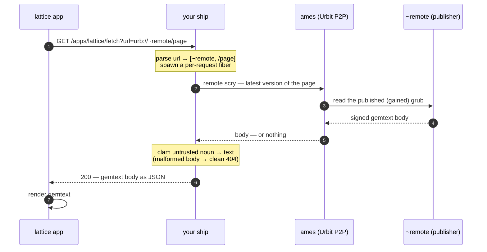

# lattice

A small, fast **gemtext browser and publisher for [Urbit](https://urbit.org)**.
Think Gemini, but the pages live on the Urbit network: every page is addressed
as `urb://~ship/path` and travels peer-to-peer between ships — no DNS, no web
server, no host in the middle. Native on Android, Linux, macOS, and Windows.

lattice has two parts:

- **ship side** — a `lattice` **nexus** running inside the
  [**grubbery**](https://github.com/gwbtc/grubbery) framework. It stores your
  pages as *published grubs* in grubbery's vault, serves them to other ships over
  remote scry, and follows remote files so you get notified when they change.
- **`app/`** — a Kotlin Multiplatform (Compose) browser/editor that talks to
  your ship over its local HTTP API.

You run the grubbery nexus on your ship and point the app at it.

## What it does

- **Browse `urb://`** — fetch and read gemtext published by any ship,
  peer-to-peer over Urbit's remote scry. Browser-style tabs (`Ctrl+T`),
  bookmarks, and history.
- **Publish** — every page you save is written as a *published grub*: a signed
  value in the Urbit namespace, instantly readable by anyone as
  `urb://~you/that/path`. Write and edit pages from inside the app.
- **Editor** — a built-in gemtext editor for your pages, with optional vim
  keybindings (off by default — it edits like a normal textarea otherwise).
- **Follow & subscribe** — follow ships to discover what they publish;
  subscribe to a specific file to get notified when it changes (your own
  files push live over an Eyre SSE channel; changes on a followed remote ship
  surface when the crawler next picks them up).
- **Discovery** — find other lattice publishers among your `%contacts` via a
  small published manifest.
- **Copy to your ship** — like a bookmark, but real: copy a remote file onto
  your own ship at a path of your choosing.
- **Fully themeable** — colors and fonts are configurable; ships with several
  built-in themes (Lattice Dark/Light and more).

## How a page reaches your app

Every published page is addressed `urb://~ship/path` and travels **peer-to-peer
over Urbit's remote scry** — no DNS, no web server, no host in the middle. Here's
the full path from a publisher's ship to your screen when you open a remote page.

**Publishing (on `~remote`).** Saving a page writes its gemtext as a grub and
**publishes it into the Urbit namespace** (a "gained" grub) — a signed value at a
fixed address that other ships can read by remote scry. That publish step is what
makes the page reachable at all; nothing else about your ship is exposed.

**Reading (on your ship).** You tap `urb://~remote/page` in the app:



1. **App → your ship.** The app calls *your* ship's local HTTP API over its
   authenticated session. It never talks to the publisher directly.
2. **Per-request handling.** Your ship parses the `urb://` URL into `[ship, path]`
   and spawns a short-lived fiber for just this request.
3. **Remote scry to the publisher.** Since the ship isn't yours, your ship issues
   a one-shot **remote scry** to `~remote` for the *latest* published version of
   that page, over ames (Urbit's peer-to-peer transport). The two ships talk
   directly — there is no central server.
4. **Untrusted by default.** The peer's reply is a raw signed noun. Your ship
   converts it to text inside a guard: a malformed or hostile body yields a clean
   404, never a crash. You're parsing a stranger's data, so it's treated as such.
5. **Back to the app.** Your ship wraps the body as JSON and returns it; the app
   renders the gemtext. **Your own pages skip the network** — they're read
   straight from your ship's local store.

**Two things worth knowing:**

- **Latest-version, clean break.** A fetch reads the *current* published version
  in one shot — no walk-to-latest, no revision chain. The publisher must be
  running lattice for a peer read to resolve.
- **On-demand vs. discovery.** Tapping a link you already have
  (`urb://~remote/page`) is the live path above. *Finding* pages you don't know
  about — following ships and searching a catalog of what they publish — is a
  separate background crawler.

## Install

### 1. The ship side (grubbery nexus)

lattice's ship side runs as a **nexus** inside the
[**grubbery**](https://github.com/gwbtc/grubbery) framework: one `%grubbery` Gall
agent hosts a tree of "apps," and lattice is one of them. So installing means get
grubbery, drop lattice's nexus into it, and commit.

1. **Install grubbery** on your ship (`%grubbery`), following grubbery's own
   install. Pin a recent commit — lattice is developed against grubbery's
   `develop`.

2. **Sync the lattice overlay** into your grubbery desk. The nexus source lives
   in this repo under [`grubbery-overlay/`](grubbery-overlay/) and must be copied
   into the `%grubbery` desk (grubbery only loads `gub/` from its own desk):
   ```bash
   ./scripts/sync-overlay.sh /path/to/your-ship/grubbery
   ```

3. **Register the nexus** — add one idempotent row to grubbery's `lib/root.hoon`
   on-load so a `/apps/lattice` directory carrying the nexus gets made (re-apply
   after pulling grubbery updates):
   ```hoon
   [%fall %| /apps/'lattice.lattice_app' [`[`[/lattice %app] ~ %.n ~] ~]]
   ```

4. **Commit** the grubbery desk:
   ```dojo
   |commit %grubbery
   ```
   The nexus materializes its tree, binds an HTTP endpoint at `/apps/lattice`,
   and starts serving. Pages you write become published grubs in the namespace.

See [`grubbery-overlay/README.md`](grubbery-overlay/README.md) for the dev loop,
and [`docs/cutover-runbook.md`](docs/cutover-runbook.md) if you're migrating an
existing `%lattice` agent's data into the nexus.

> Access is enforced by grubbery **weirs** (per-directory ACLs): your published
> pages are namespace-public by design (that's the point — it's a publishing
> tool), your private knowledge store is owner-only, and the HTTP API requires a
> valid ship session. Nothing else leaves your ship.

### 2. The app

Grab your platform from the
[latest release](https://github.com/nisfeb/lattice/releases/latest):

| Platform | File | How to install |
|---|---|---|
| Android | `lattice-X.Y.Z.apk` | Tap to install; you may need to allow "Install unknown apps". Android 8+ (API 26). |
| Linux (any) | `lattice-x86_64.AppImage` | `chmod +x lattice-x86_64.AppImage && ./lattice-x86_64.AppImage`. Needs FUSE 2 (default on most desktops). |
| Debian / Ubuntu | `lattice_*_amd64.deb` | `sudo apt install ./lattice_*_amd64.deb` |
| macOS | `lattice-*.dmg` | Open the DMG, drag lattice to Applications. **First launch:** right-click → Open → Open (unsigned, so Gatekeeper blocks a plain double-click). |
| Windows | `lattice-*.msi` | Double-click. SmartScreen may warn — "More info" → "Run anyway". |

Desktop builds bundle their own JRE, so you don't need Java installed.

Open the app, enter your ship's URL and `+code`, and you're browsing. New to
Urbit? [urbit.org/overview/running-urbit](https://urbit.org/overview/running-urbit)
walks you through booting a ship.

> **Connecting to a remote ship:** lattice refuses to send your `+code` or
> session cookie in cleartext, so a non-local ship must be reached over
> `https` (loopback `http` is fine for a ship on the same machine or a tunnel).

## Connect an AI agent (MCP)

lattice keeps a **private knowledge store** that AI agents can read and write
over [MCP](https://modelcontextprotocol.io) — ten tools: `lattice-save`,
`lattice-read`, `lattice-list`, `lattice-search`, `lattice-explore`,
`lattice-delete`, `lattice-restore`, `lattice-tags`, `lattice-tag`,
`lattice-untag`. Agents can tag items and discover them by tag or substring
(`lattice-explore`), the same faceted discovery the app's Knowledge **Explore**
mode offers. Anything an agent saves or tags shows up in the app's Knowledge
screen, and vice-versa. Full details: [docs/agent-knowledge.md](docs/agent-knowledge.md).

You need the [`%mcp-server`](https://github.com/gwbtc/urbit-mcp) agent on the
ship, and the ship reachable over `https` (put it behind a reverse proxy with
TLS; don't expose the raw `--http-port`).

**Authenticating — the part that trips people up.** Two different things, don't
mix them:

- **`+code`** — the 4 hyphenated words from `+code` in the dojo. Your master
  login secret. Never paste it anywhere but a login prompt; never share it.
- **session cookie** — `urbauth-~your-ship=0v…`, what `/~/login` *returns* once
  you give it the `+code`. This is the revocable, expiring token your client and
  tools actually use.

Mint a cookie with a **verified** login — and check the status, because a *failed*
login (wrong `+code`) still hands back a `Set-Cookie` (an unauthenticated stub),
which is the #1 cause of "my cookie doesn't work":

```bash
read -rsp '+code: ' CODE && echo
curl -sS -D - -o /dev/null -X POST https://your-ship.example.com/~/login \
  --data-urlencode "password=$CODE" \
| awk 'BEGIN{IGNORECASE=1} /^HTTP/{print "status:",$2} /^set-cookie/{print}'
unset CODE
```

Only trust the cookie if `status:` is **200/204** (a `400` means a wrong `+code`).
The `+code` is read with `-s` (no echo) and never leaves your machine.

Then:

1. **`.mcp.json`** (your MCP client's config) — add the server:
   ```json
   { "mcpServers": { "myship": {
       "url": "https://your-ship.example.com/mcp",
       "headers": { "Cookie": "urbauth-~your-ship=0v…" } } } }
   ```
2. **Register the tools once** — the script prompts for the `+code` the same
   hidden way and authenticates itself:
   ```bash
   python3 scripts/setup-knowledge-mcp-tools.py myship
   ```
3. **Reconnect** your client and approve the server. Test with *"list my lattice
   knowledge."*

The cookie expires (and dies if the ship restarts) — just re-run the login to
refresh it. Re-registering tools after a lattice upgrade needs a reset first; see
[docs/agent-knowledge.md](docs/agent-knowledge.md).

## What it isn't

- **Not a host.** Bring your own ship — yours, a friend's, or a hosted one.
- **Not the HTTP web.** Pages are Urbit-native (`urb://~ship/path`) and move
  between ships over remote scry, not over DNS/HTTP.
- **Not on the app stores.** Sideload the APK / installers from GitHub Releases.
- **Desktop builds are unsigned** for now — your OS will warn on first launch.

## Building from source

Gradle lives in [`app/`](app/); the ship-side nexus source is in
[`grubbery-overlay/`](grubbery-overlay/). A
full **JDK 17** is required — note that some distros ship `java-17-openjdk` as a
JRE without `javac`; JDK 21 also works.

```bash
cd app
./gradlew :composeApp:run                  # run the desktop app
./gradlew :composeApp:assembleDebug        # debug APK
./gradlew :composeApp:assembleRelease      # release APK (signed if keystore set)
./gradlew :composeApp:packageReleaseDeb    # desktop installer (host OS only)
# Portable Linux AppImage (from the repo root):
./scripts/build-appimage.sh
```

The nexus's pure lib has Hoon unit tests under
[`grubbery-overlay/tests/`](grubbery-overlay/tests/) (run via grubbery's
`run-tests`); the app has a JVM test suite (`./gradlew :composeApp:desktopTest`).
CI runs both on every PR.

## Releases

Tagging `v*` triggers `.github/workflows/release.yml`, which builds the desktop
installers (`.deb`/`.dmg`/`.msi`/`.AppImage`) and — when signing secrets are set
— the Android APK, then publishes a GitHub Release. See [RELEASE.md](RELEASE.md).

## Layout

```
grubbery-overlay/  the lattice nexus — lattice's ship side (nex/ lib/ mar/ tests/)
app/               Kotlin Multiplatform Compose app (Android + desktop)
web/               marketing pages (HTML + a gemtext page, fittingly)
scripts/           build + overlay-sync helpers
docs/              deeper design docs (migration/cutover, catalog, MCP knowledge)
```

## License

[PolyForm Noncommercial 1.0.0](LICENSE.md). Free to use, modify, and share for
any noncommercial purpose; commercial use requires a separate license.

---

© lattice — built by ~nisfeb. PolyForm Noncommercial 1.0.0 licensed.
