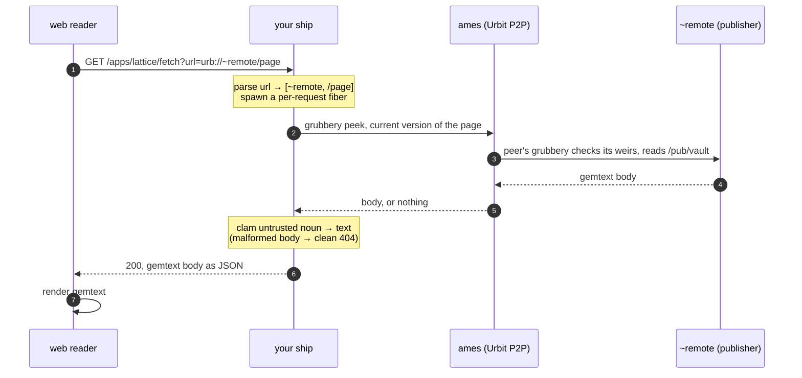

# lattice

**A personal knowledge platform on your [Urbit](https://urbit.org) ship.**
Write pages in markdown, gemtext, or HTML, or write programmable pages in Hoon
that compute their own content. Keep a private, tagged knowledge store that you
and your AI agents share. Search all of it in full text. Publishing is
peer-to-peer. Every published page is addressed as `urb://~ship/path` and
travels ship-to-ship over Urbit's network, with no DNS, no web server, and no host
in the middle.

One store, every surface:

- **web**: a reader, a workspace editor with live preview and drag-and-drop
  upload of files or whole directories, a knowledge browser, and an
  installable PWA. All of it is served straight from the ship. lattice hosts
  its own client.
- **filesystem** ([`lattice-fs-rs/`](lattice-fs-rs/)): a Rust FUSE client that
  mounts your page tree as local files. `rg` everything at RAM speed, edit in
  your own editor, and mount any other grubbery app tree too.
- **desktop** ([`desktop/`](desktop/)): a Tauri shell that wraps the
  ship-served web client and manages `lattice-fs` mounts: one login, one
  window, clean unmounts on quit. Linux + macOS, with prebuilt bundles
  (deb, AppImage, dmg) on the
  [releases page](https://github.com/nisfeb/lattice/releases) and a Nix
  flake (`nix build .#lattice-desktop`). It auto-detects piers running on
  the same machine and offers grubbery's local IPC instead of HTTP.
- **AI agents**: eleven MCP knowledge tools compiled into the ship itself and
  served at `/grubbery/mcp`. Your assistant's memory lives on your ship,
  not in someone's cloud.

The ship side is a `lattice` **nexus** running inside the
[**grubbery**](https://github.com/gwbtc/grubbery) framework. Pages and
knowledge live as grubs in grubbery's vault. Published pages are served to
other ships over ames, and followed remote files push you updates.

## What it does

- **Pages, not just gemtext.** Write in markdown, gemtext, HTML, plain text,
  JS, or CSS. Or write a page in Hoon and it *computes* its content:
  programmable pages with commands, state, and dependencies on other pages.
- **Knowledge store.** A private, tagged note store with per-entry history
  and a trash you can restore from. Browse it in the workspace with folders,
  tag filters, and live updates. Drive it from the web app, HTTP, MCP, or
  the FUSE mount.
- **Search.** A term index over your pages and your knowledge store, queried
  from the reader's omnibar. Every hit is badged with its scope, so a
  published page never reads like a private note.
- **A real filesystem.** `lattice-fs` mounts your pages as files over HTTP or
  grubbery's local IPC. A cold mount warms in one round-trip, so `grep` and
  `cat` run from RAM. Editor saves round-trip safely, and backup or swap
  files never touch the ship.
- **Browse `urb://`.** Fetch and read gemtext published by any ship,
  peer-to-peer over ames, from the web reader.
- **Publish.** Pages are private until you share them. Share one and it is published: copied into your published vault, bound in the Urbit scry namespace, and readable by any ship as `urb://~you/that/path`. Pages and whole folders can also go clearweb-public, served over plain HTTP at `/c/<path>`. Share a folder and you've published a site.
- **Editor.** A web workspace with syntax highlighting for every page kind,
  live preview, compile errors for Hoon pages, folder-level share, move, and
  delete, and drag-and-drop upload of files or whole directories (batched
  into single requests, so a 20-file drop costs one round-trip, not twenty).
  Resizable panes, font and size settings, and page templates, including a
  live-location page that renders a map, trails your recent positions, and
  expires itself.
- **Works offline.** Lose the ship mid-session and saves queue locally
  (pages and knowledge entries both), then replay when it returns. Deletes,
  moves and renames queue too, in an ordered log that drains ahead of the
  saves, so a page you edit and then rename arrives under its new name.
  Concurrent edits are never lost. The newest version wins and the
  overwritten one is preserved as a real page under `conflicts/`. The tree
  snapshot lives in IndexedDB, so the editor paints instantly on launch and
  works from the last-known tree while unreachable.
- **Export the whole vault.** One button in the controls pane downloads every
  page and every memory as a single tar. Pages come out as plain files named
  for their paths, so unpacking it gives you an ordinary directory you can
  read without lattice, grep, or put in git. The memories also come out in
  the format the bulk importer reads back. Anything the export could not read
  is named in the status line rather than quietly left out.
- **And restore one.** "restore vault" takes an archive back, putting pages at
  the paths they came from and memories back with their tags and dates. It
  reads ordinary tar, not a private format, so an export you unpacked, edited
  in vim and tarred up again restores just the same. It says how many existing
  pages it will overwrite before it acts, and the version being replaced stays
  in that page's history. A damaged archive is refused on its checksum rather
  than half-applied.
- **Bookmarks.** Star any `urb://` page from the reader bar. The full list at
  `/apps/lattice/marks` is organized into folders and searchable as you
  type. The omnibar ranks bookmarks above history.
- **Comments.** Readers can leave comments on pages you publish. A
  moderation inbox in the workspace lists and removes them.
- **Sharing that scales.** Named groups of ships with per-path read/edit
  grants, editable in a full ACL pane; per-file grants to a ship or a group
  from the editor; and a banlist that revokes on ban. A banned ship is
  stripped from every group, and new grants to it are refused.
- **Follow & subscribe.** Follow ships to keep track of what they publish, or subscribe to a specific file. Your own files push live over an Eyre SSE channel. A subscribed remote file rides a live subscription to that file on the other ship. Each edit announces its new revision, and your ship fetches exactly that revision from the publisher's scry namespace, so it arrives as it happens rather than on a timer.
- **Discovery.** Every lattice ship serves a small gemtext manifest of what
  it has published. Fetch `urb://~ship/manifest` to see a stranger's index.
- **Copy to your ship.** Like a bookmark, but real: copy a remote file onto
  your own ship at a path of your choosing.
- **Light and dark.** The reader, the editor, and the PWA all follow your
  system theme.

## How a page reaches your screen

Every published page is addressed `urb://~ship/path` and travels **peer-to-peer over Urbit's network**. There is no DNS, no web server, and no host in the middle. Here's the full path from a publisher's ship to your screen, first when you open a remote page and then when you follow one.

**Publishing (on `~remote`).** Sharing a page **publishes it**. Its gemtext is copied into the published vault, which grubbery's `/public` usergroup lets every ship read. Each revision is also bound in the Urbit scry namespace at its own permanent address, `/pub/page/<name>/<rev>`. That publish step is what makes the page reachable at all. Private pages are never copied there, and nothing else about your ship is exposed.

**Reading (on your ship).** You tap `urb://~remote/page` in the reader:


```mermaid
sequenceDiagram
    autonumber
    participant App as web reader
    participant You as your ship
    participant Ames as ames (Urbit P2P)
    participant Peer as ~remote (publisher)
    App->>You: GET /apps/lattice/fetch?url=urb://~remote/page
    Note over You: parse url → [~remote, /page]<br/>spawn a per-request fiber
    You->>Ames: grubbery peek, current version of the page
    Ames->>Peer: peer's grubbery checks its weirs, reads /pub/vault
    Peer-->>Ames: gemtext body
    Ames-->>You: body, or nothing
    Note over You: clam untrusted noun → text<br/>(malformed body → clean 404)
    You-->>App: 200, gemtext body as JSON
    App->>App: render gemtext
```

1. **Reader → your ship.** The reader calls *your* ship's local HTTP API over
   its authenticated session. It never talks to the publisher directly.
2. **Per-request handling.** Your ship parses the `urb://` URL into
   `[ship, path]` and spawns a short-lived fiber for just this request.
3. **A peek to the publisher.** Since the ship isn't yours, your ship sends a one-shot **grubbery peek** to `~remote` for the *current* published version of that page, over ames, Urbit's encrypted peer-to-peer transport. The publisher's grubbery checks its access rules before it answers. The two ships talk directly. There is no central server.
4. **Untrusted by default.** The peer's reply is a raw noun. Your ship
   converts it to text inside a guard, so a malformed or hostile body yields
   a clean 404, never a crash. You're parsing a stranger's data, and it's
   treated as such.
5. **Back to the reader.** Your ship wraps the body as JSON and returns it,
   and the reader renders the gemtext. **Your own pages skip the network.**
   They're read straight from your ship's local store.

**Two things worth knowing:**

- **Latest-version, clean break.** A fetch reads the *current* published
  version in one shot. There is no walk-to-latest and no revision chain. The
  publisher must be running lattice for a peer read to resolve.
- **Following is a live subscription, not a poll.** Subscribing to a peer's page rides one keep on the published grub. The peer's edit sends a wave carrying only the new revision number. Your ship then reads that exact revision out of the publisher's scry namespace with a remote scry request (Urbit's directed messaging), which the publisher's kernel answers without waking lattice. Nothing is fetched on a timer.
- **Namespace reads are not encrypted.** Those remote scry requests use Urbit's unencrypted mode, so a shared page's revisions are readable in transit. That matches what sharing already means, since every ship may read a shared page. A page granted to one specific ship travels by peek over encrypted ames instead.

## Install

### 1. The ship side (grubbery nexus)

lattice's ship side runs as a **nexus** inside the
[**grubbery**](https://github.com/gwbtc/grubbery) framework, and ships as a
`%grubbery` desk that already contains it. One command in your dojo:

```dojo
|install ~ricsul-bilwyt %grubbery
```

That pulls the desk, boots grubbery, creates the lattice app, binds
`/apps/lattice`, and starts serving. Updates arrive on their own: every
release the publisher commits is fetched and merged by kiln, the same way
any Urbit desk updates. Pause them with `|pause %grubbery`, resume with
`|resume %grubbery`.

The desk is grubbery with lattice and the MCP server and nothing else. If
you already run a full grubbery from another publisher, installing from
`~ricsul-bilwyt` replaces your desk source, and any apps that live only in
the other publisher's desk stop until their code comes back. See
[docs/grubbery-ops.md](docs/grubbery-ops.md) before switching.

On first boot lattice also installs [`%obelisk`](https://github.com/dister-nomryg-nilref)
from `~dister-nomryg-nilref` if you don't have it, so the optional search
mirror has a database to talk to. The mirror itself stays off until you
switch it on in settings.

**Developing lattice, or publishing your own build:** the nexus source
lives in this repo under [`grubbery-overlay/`](grubbery-overlay/) and is
copied into a grubbery desk with `scripts/sync-overlay.sh`. That desk, made
public with `|public %grubbery`, is what installers pull. The dev loop is
in [`grubbery-overlay/README.md`](grubbery-overlay/README.md); migrating an
old standalone `%lattice` agent's data into the nexus is in
[`docs/cutover-runbook.md`](docs/cutover-runbook.md).

> Access is enforced by grubbery **weirs**, which are per-directory ACLs.
> Your published pages are namespace-public by design. That's the point of a
> publishing tool. Your private knowledge store is owner-only, and the HTTP
> API requires a valid ship session. Nothing else leaves your ship.

### 2. The client

There is nothing to install, because lattice hosts its own client. Log into
your ship's web login (`/~/login` with your `+code`) and open:

- **`/apps/lattice`**: the reader. Your pages, the `urb://` omnibar, search,
  and the ships you follow.
- **`/apps/lattice/app`**: the workspace. Tree, editor with highlighting and
  live preview, sharing controls, uploads, and the knowledge browser.

On a phone, use your browser's *Install app / Add to Home Screen*. lattice
is a full PWA with its own icon and standalone window. It resumes the page
you left open and keeps working offline. On Linux or macOS there is also an
optional [desktop app](https://github.com/nisfeb/lattice/releases): the same
ship-served client in its own window, plus managed filesystem mounts and
auto-detection of piers on the same machine. New to Urbit?
[urbit.org/overview/running-urbit](https://urbit.org/overview/running-urbit)
walks you through booting a ship.

## Connect an AI agent (MCP)

lattice keeps a **private knowledge store** that AI agents can read and
write over [MCP](https://modelcontextprotocol.io), through eleven tools:
`lattice-save`, `lattice-read`, `lattice-list`, `lattice-search`,
`lattice-explore`, `lattice-delete`, `lattice-restore`, `lattice-move`,
`lattice-tags`, `lattice-tag`, `lattice-untag`. Agents can tag items and
discover them by tag or substring with `lattice-explore`, the same faceted
discovery the web app's knowledge mode offers. Anything an agent saves or
tags shows up in the knowledge browser, and vice-versa. Full details are in
[docs/agent-knowledge.md](docs/agent-knowledge.md).

The tools are **compiled into the ship itself**. They ship with the lattice
desk (`lib/mcp/lattice-*.hoon`), execute in-ship against the vault directly,
and are served by grubbery's own MCP endpoint at `<ship>/grubbery/mcp`.
There is nothing to install or register, and they survive restarts and
redeploys. Make the ship reachable over `https` with a reverse proxy that
terminates TLS. Don't expose the raw `--http-port`.

**Authenticating, the part that trips people up.** Two different things,
don't mix them:

- **`+code`**: the 4 hyphenated words from `+code` in the dojo. Your master
  login secret. Never paste it anywhere but a login prompt, and never share
  it.
- **session cookie**: `urbauth-~your-ship=0v…`, what `/~/login` *returns*
  once you give it the `+code`. This is the revocable, expiring token your
  client and tools actually use.

Mint a cookie with a **verified** login, and check the status. A *failed*
login with a wrong `+code` still hands back a `Set-Cookie` stub, which is
the #1 cause of "my cookie doesn't work":

```bash
read -rsp '+code: ' CODE && echo
curl -sS -D - -o /dev/null -X POST https://your-ship.example.com/~/login \
  --data-urlencode "password=$CODE" \
| awk 'BEGIN{IGNORECASE=1} /^HTTP/{print "status:",$2} /^set-cookie/{print}'
unset CODE
```

Only trust the cookie if `status:` is **200/204**. A `400` means a wrong
`+code`. The `+code` is read with `-s` (no echo) and never leaves your
machine.

Then point your MCP client at the ship. That's the whole setup, since the
tools live in the ship already:

```json
{ "mcpServers": { "myship": {
    "url": "https://your-ship.example.com/grubbery/mcp",
    "headers": { "Cookie": "urbauth-~your-ship=0v…" } } } }
```

When the ship restarts, the cookie expires. Mint a fresh one the same way
and update the header. There is nothing else to re-register. Test with
*"list my lattice knowledge."*

## What it isn't

- **Not a host.** Bring your own ship: yours, a friend's, or a hosted one.
- **Not the HTTP web.** Pages are Urbit-native (`urb://~ship/path`) and move
  between ships over ames, not over DNS/HTTP. The exception is what
  you *choose* to publish clearweb, which your ship serves itself at
  `/c/<path>`.
- **Not an app to install.** The client is served by your ship. The only
  local piece is the optional FUSE client.

## Building from source

The ship-side nexus source is in [`grubbery-overlay/`](grubbery-overlay/).
Sync it into a grubbery desk and commit (see Install above). The FUSE client
builds with `cargo build --release` in [`lattice-fs-rs/`](lattice-fs-rs/).

The desktop app builds with `cargo build --release` in
[`desktop/`](desktop/) (or `cargo tauri build` for bundles, or
`nix build .#lattice-desktop`). Tagged commits (`v*` matching the version
in `desktop/tauri.conf.json`) trigger a release workflow that builds and
drafts all four bundles.

The nexus's pure lib has Hoon unit tests under
[`grubbery-overlay/tests/`](grubbery-overlay/tests/), run via grubbery's
`run-tests`. The FUSE client has a 19-assertion ship-verified regression
matrix (`scripts/fs-matrix.sh`). Seven integration matrices exercise a
running harness ship end to end: `ui-matrix`, `ui-boot`, `ui-perf`,
`ui-offline`, and `ui-acl-prefs` drive the web app through headless
Chromium (boot races, request budgets, offline queue and conflicts, ACLs),
`api-matrix.sh` walks the HTTP routes, and `mcp-matrix.sh` round-trips all
eleven knowledge tools over MCP. A nightly workflow runs the lot.

## Layout

```
grubbery-overlay/  the lattice nexus: ship side (nex/ lib/ mar/ tests/),
                   the web client (nex/lattice/ui-app/), and the in-ship
                   MCP knowledge tools (lib/mcp/)
lattice-fs-rs/     Rust FUSE client that mounts the page tree as a filesystem
desktop/           Tauri desktop shell: bridge proxy, mount manager, pier
                   auto-detection, release bundles
web/               the website (self-contained HTML + a gemtext edition,
                   organized to be uploaded to and hosted on lattice itself)
scripts/           overlay-sync helpers, integration matrices, deploy
docs/              agent guide, grubbery ops, search index, offline-edits design
```

## License

[PolyForm Noncommercial 1.0.0](LICENSE.md). Free to use, modify, and share
for any noncommercial purpose. Commercial use requires a separate license.

---

© lattice, built by ~nisfeb. PolyForm Noncommercial 1.0.0 licensed.
