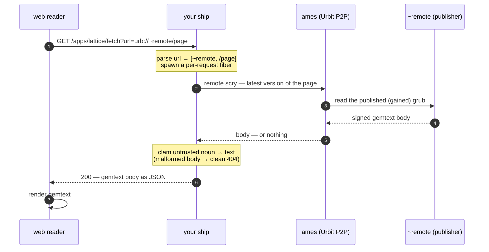

# lattice

**A personal knowledge platform on your [Urbit](https://urbit.org) ship.**
Pages in markdown, gemtext, or HTML — or programmable pages in Hoon that
compute their own content. A private, tagged knowledge store that you and your
AI agents share. Full-text search across all of it. And publishing that is
peer-to-peer: every published page is addressed as `urb://~ship/path` and
travels ship-to-ship over remote scry — no DNS, no web server, no host in the
middle.

One store, every surface:

- **web** — a reader, a workspace editor (live preview, drag-and-drop upload of
  files or whole directories), a knowledge browser, and an installable PWA —
  all served straight from the ship. lattice hosts its own client.
- **filesystem** ([`lattice-fs-rs/`](lattice-fs-rs/)) — a Rust FUSE client that
  mounts your page tree as local files: `rg` everything at RAM speed, edit in
  your own editor, and mount any other grubbery app tree too.
- **AI agents** — eleven MCP knowledge tools compiled into the ship itself and
  served at `/grubbery/mcp`. Your assistant's memory lives on your ship,
  not in someone's cloud.

The ship side is a `lattice` **nexus** running inside the
[**grubbery**](https://github.com/gwbtc/grubbery) framework: pages and
knowledge live as grubs in grubbery's vault, published pages are served to
other ships over remote scry, and followed remote files push you updates.

## What it does

- **Pages, not just gemtext** — write in markdown, gemtext, HTML, plain text,
  JS, or CSS; or write a page in Hoon and it *computes* its content
  (programmable pages with commands, state, and dependencies on other pages).
- **Knowledge store** — a private, tagged note store with per-entry history
  and a trash you can restore from. Browse it at `/apps/lattice/know`
  (folders, tag filters, live updates); drive it from the app, HTTP, MCP, or
  the FUSE mount.
- **Search** — an obelisk-backed catalog gives full-text search across your
  pages and the ships you follow, from the reader's omnibar.
- **A real filesystem** — `lattice-fs` mounts your pages as files over HTTP or
  grubbery's local IPC. A cold mount warms in one round-trip, so `grep`/`cat`
  run from RAM; editor saves round-trip safely (backup/swap files never touch
  the ship).
- **Browse `urb://`** — fetch and read gemtext published by any ship,
  peer-to-peer over Urbit's remote scry, from the web reader.
- **Publish** — every page you save is written as a *published grub*: a signed
  value in the Urbit namespace, instantly readable by anyone as
  `urb://~you/that/path`. Pages and whole folders can also go
  clearweb-public, served over plain HTTP at `/c/<path>` — share a folder
  and you've published a site.
- **Editor** — a web workspace with syntax highlighting for every page kind,
  live preview, compile errors for Hoon pages, folder-level share/move/delete,
  and drag-and-drop upload of files or whole directories.
- **Follow & subscribe** — follow ships to discover what they publish;
  subscribe to a specific file to get notified when it changes (your own
  files push live over an Eyre SSE channel; changes on a followed remote ship
  surface when the crawler next picks them up).
- **Discovery** — find other lattice publishers among your `%contacts` via a
  small published manifest.
- **Copy to your ship** — like a bookmark, but real: copy a remote file onto
  your own ship at a path of your choosing.
- **Light and dark** — every surface (reader, editor, PWA) follows your
  system theme.

## How a page reaches your screen

Every published page is addressed `urb://~ship/path` and travels **peer-to-peer
over Urbit's remote scry** — no DNS, no web server, no host in the middle. Here's
the full path from a publisher's ship to your screen when you open a remote page.

**Publishing (on `~remote`).** Saving a page writes its gemtext as a grub and
**publishes it into the Urbit namespace** (a "gained" grub) — a signed value at a
fixed address that other ships can read by remote scry. That publish step is what
makes the page reachable at all; nothing else about your ship is exposed.

**Reading (on your ship).** You tap `urb://~remote/page` in the reader:


```mermaid
sequenceDiagram
    autonumber
    participant App as web reader
    participant You as your ship
    participant Ames as ames (Urbit P2P)
    participant Peer as ~remote (publisher)
    App->>You: GET /apps/lattice/fetch?url=urb://~remote/page
    Note over You: parse url → [~remote, /page]<br/>spawn a per-request fiber
    You->>Ames: remote scry — latest version of the page
    Ames->>Peer: read the published (gained) grub
    Peer-->>Ames: signed gemtext body
    Ames-->>You: body — or nothing
    Note over You: clam untrusted noun → text<br/>(malformed body → clean 404)
    You-->>App: 200 — gemtext body as JSON
    App->>App: render gemtext
```

1. **Reader → your ship.** The reader calls *your* ship's local HTTP API over
   its authenticated session. It never talks to the publisher directly.
2. **Per-request handling.** Your ship parses the `urb://` URL into `[ship, path]`
   and spawns a short-lived fiber for just this request.
3. **Remote scry to the publisher.** Since the ship isn't yours, your ship issues
   a one-shot **remote scry** to `~remote` for the *latest* published version of
   that page, over ames (Urbit's peer-to-peer transport). The two ships talk
   directly — there is no central server.
4. **Untrusted by default.** The peer's reply is a raw signed noun. Your ship
   converts it to text inside a guard: a malformed or hostile body yields a clean
   404, never a crash. You're parsing a stranger's data, so it's treated as such.
5. **Back to the reader.** Your ship wraps the body as JSON and returns it; the
   reader renders the gemtext. **Your own pages skip the network** — they're
   read straight from your ship's local store.

**Two things worth knowing:**

- **Latest-version, clean break.** A fetch reads the *current* published version
  in one shot — no walk-to-latest, no revision chain. The publisher must be
  running lattice for a peer read to resolve.
- **On-demand vs. discovery.** Tapping a link you already have
  (`urb://~remote/page`) is the live path above. *Finding* pages you don't know
  about — following ships and searching a catalog of what they publish — is a
  separate background crawler.

## Install

### 1. The ship side (grubbery nexus)

lattice's ship side runs as a **nexus** inside the
[**grubbery**](https://github.com/gwbtc/grubbery) framework: one `%grubbery` Gall
agent hosts a tree of "apps," and lattice is one of them. So installing means get
grubbery, drop lattice's nexus into it, and commit.

1. **Install grubbery** on your ship (`%grubbery`), following grubbery's own
   install. Pin a recent commit — lattice is developed against grubbery's
   `develop`.

2. **Sync the lattice overlay** into your grubbery desk. The nexus source lives
   in this repo under [`grubbery-overlay/`](grubbery-overlay/) and must be copied
   into the `%grubbery` desk (grubbery only loads `gub/` from its own desk):
   ```bash
   ./scripts/sync-overlay.sh /path/to/your-ship/grubbery
   ```

3. **Commit** the grubbery desk:
   ```dojo
   |commit %grubbery
   ```

4. **Install the app** — committing the source does *not* install it; an app is
   a folder in grubbery's ball. Create it once with grubbery's MCP
   `create_folder` tool (the `nexus` param is mandatory and stab-parsed):
   ```json
   create_folder {"path":"/apps","name":"lattice.lattice_app","nexus":"/lattice/app"}
   ```
   The nexus materializes its tree, binds an HTTP endpoint at `/apps/lattice`,
   and starts serving. Pages you write become published grubs in the namespace.
   (Full deploy/ops detail: [docs/grubbery-ops.md](docs/grubbery-ops.md).)

See [`grubbery-overlay/README.md`](grubbery-overlay/README.md) for the dev loop,
and [`docs/cutover-runbook.md`](docs/cutover-runbook.md) if you're migrating an
existing `%lattice` agent's data into the nexus.

> Access is enforced by grubbery **weirs** (per-directory ACLs): your published
> pages are namespace-public by design (that's the point — it's a publishing
> tool), your private knowledge store is owner-only, and the HTTP API requires a
> valid ship session. Nothing else leaves your ship.

### 2. The client

There is nothing to install — lattice hosts its own client. Log into your
ship's web login (`/~/login` with your `+code`) and open:

- **`/apps/lattice`** — the reader: your pages, the `urb://` omnibar,
  catalog search, and the ships you follow.
- **`/apps/lattice/app`** — the workspace: tree, editor with highlighting
  and live preview, sharing controls, uploads, and the knowledge browser.

On a phone, use your browser's *Install app / Add to Home Screen* — it's a
full PWA with its own icon and standalone window. New to Urbit?
[urbit.org/overview/running-urbit](https://urbit.org/overview/running-urbit)
walks you through booting a ship.

## Connect an AI agent (MCP)

lattice keeps a **private knowledge store** that AI agents can read and write
over [MCP](https://modelcontextprotocol.io) — eleven tools: `lattice-save`,
`lattice-read`, `lattice-list`, `lattice-search`, `lattice-explore`,
`lattice-delete`, `lattice-restore`, `lattice-move`, `lattice-tags`,
`lattice-tag`, `lattice-untag`. Agents can tag items and discover them by tag or substring
(`lattice-explore`), the same faceted discovery the web app's knowledge mode
offers. Anything an agent saves or tags shows up in the knowledge browser,
and vice-versa. Full details: [docs/agent-knowledge.md](docs/agent-knowledge.md).

The tools are **compiled into the ship itself** — they ship with the lattice
desk (`lib/mcp/lattice-*.hoon`), execute in-ship against the vault directly,
and are served by grubbery's own MCP endpoint at `<ship>/grubbery/mcp`.
Nothing to install or register, and they survive restarts and redeploys. Make
the ship reachable over `https` (a reverse proxy with TLS; don't expose the
raw `--http-port`).

**Authenticating — the part that trips people up.** Two different things, don't
mix them:

- **`+code`** — the 4 hyphenated words from `+code` in the dojo. Your master
  login secret. Never paste it anywhere but a login prompt; never share it.
- **session cookie** — `urbauth-~your-ship=0v…`, what `/~/login` *returns* once
  you give it the `+code`. This is the revocable, expiring token your client and
  tools actually use.

Mint a cookie with a **verified** login — and check the status, because a *failed*
login (wrong `+code`) still hands back a `Set-Cookie` (an unauthenticated stub),
which is the #1 cause of "my cookie doesn't work":

```bash
read -rsp '+code: ' CODE && echo
curl -sS -D - -o /dev/null -X POST https://your-ship.example.com/~/login \
  --data-urlencode "password=$CODE" \
| awk 'BEGIN{IGNORECASE=1} /^HTTP/{print "status:",$2} /^set-cookie/{print}'
unset CODE
```

Only trust the cookie if `status:` is **200/204** (a `400` means a wrong `+code`).
The `+code` is read with `-s` (no echo) and never leaves your machine.

Then point your MCP client at the ship — that's the whole setup, since the
tools live in the ship already:

```json
{ "mcpServers": { "myship": {
    "url": "https://your-ship.example.com/grubbery/mcp",
    "headers": { "Cookie": "urbauth-~your-ship=0v…" } } } }
```

When the ship restarts, the cookie expires — mint a fresh one the same way and
update the header. (There is nothing else to re-register.)
3. **Reconnect** your client and approve the server. Test with *"list my lattice
   knowledge."*

The cookie expires (and dies if the ship restarts) — just re-run the login to
refresh it. Re-registering tools after a lattice upgrade needs a reset first; see
[docs/agent-knowledge.md](docs/agent-knowledge.md).

## What it isn't

- **Not a host.** Bring your own ship — yours, a friend's, or a hosted one.
- **Not the HTTP web.** Pages are Urbit-native (`urb://~ship/path`) and move
  between ships over remote scry, not over DNS/HTTP — except what you
  *choose* to publish clearweb, which your ship serves itself at `/c/<path>`.
- **Not an app to install.** The client is served by your ship; the only
  local piece is the optional FUSE client.

## Building from source

The ship-side nexus source is in [`grubbery-overlay/`](grubbery-overlay/) —
sync it into a grubbery desk and commit (see Install above). The FUSE client
builds with `cargo build --release` in [`lattice-fs-rs/`](lattice-fs-rs/).

The nexus's pure lib has Hoon unit tests under
[`grubbery-overlay/tests/`](grubbery-overlay/tests/) (run via grubbery's
`run-tests`); the FUSE client has a 19-assertion ship-verified regression
matrix (`scripts/fs-matrix.sh`).

## Layout

```
grubbery-overlay/  the lattice nexus — ship side (nex/ lib/ mar/ tests/),
                   the web client (nex/lattice/ui-app/), and the in-ship
                   MCP knowledge tools (lib/mcp/)
lattice-fs-rs/     Rust FUSE client — mount the page tree as a filesystem
web/               the website (self-contained HTML + a gemtext edition,
                   organized to be uploaded to and hosted on lattice itself)
scripts/           overlay-sync helpers, fs regression matrix
docs/              agent guide, grubbery ops, catalog, cutover runbooks
```

## License

[PolyForm Noncommercial 1.0.0](LICENSE.md). Free to use, modify, and share for
any noncommercial purpose; commercial use requires a separate license.

---

© lattice — built by ~nisfeb. PolyForm Noncommercial 1.0.0 licensed.
