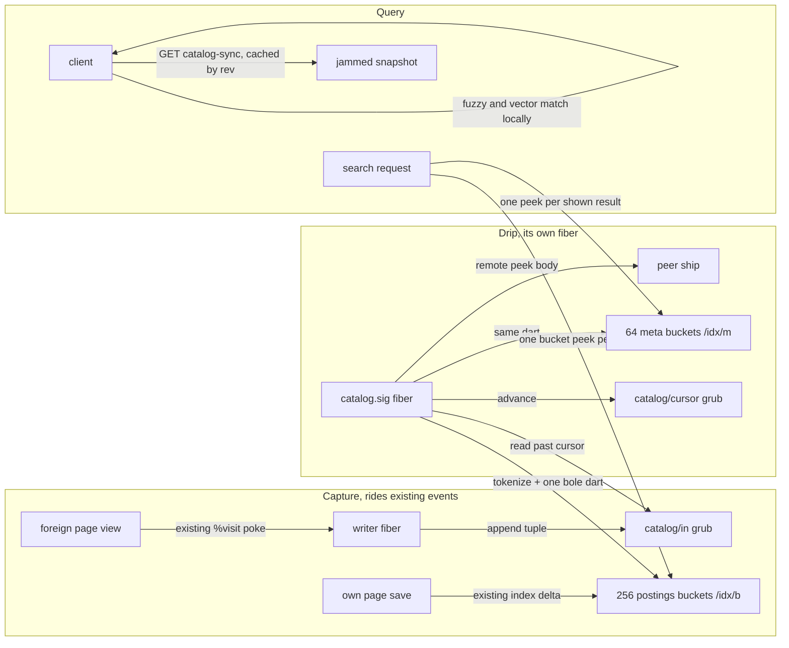
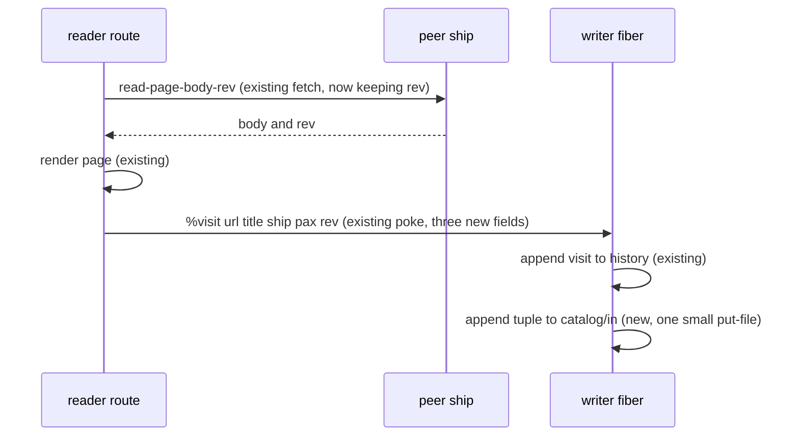
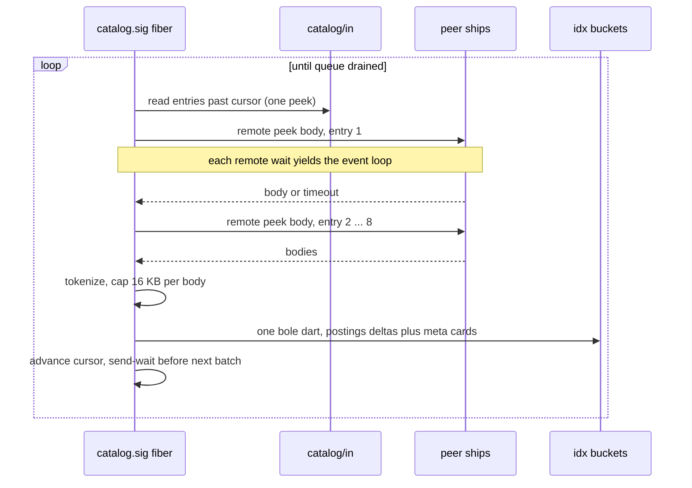

# Catalog v2: search across all known content

This document specifies the second attempt at a content catalog. The goal is
effective search across everything the owner knows about, which means their
own pages, their private memories, and pages they have viewed on other
people's ships. The first catalog was removed in August 2026 after it wedged
the ship for minutes at a time. This design exists to deliver the same value
without that failure mode.

Terminology used here comes from grubbery. A grub is a stored file plus a
process. A bole is a tree of grubs written in one operation. A fiber is a
cooperative process that runs inside gall events and yields at every
network wait. The writer is the single fiber that serializes all lattice
mutations. The cost model this design obeys is documented in
`docs/native-index.md` and was measured from source. Its facts are cited
below by number.

## 1. Why the first catalog died

The autopsy matters because every decision below is shaped by it.

1. The crawler swept the entire corpus in one gall event. A gall event runs
   to completion before the ship serves anything else, so a sweep over a
   large vault meant minutes of downtime. The behn stall investigated in
   August 2026 was exactly this: one timer event revalidating the whole
   database.
2. The catalog stored everything in one obelisk database grub. Grubbery
   revalidates a grub through its mark on every write, so every insert paid
   a cost proportional to the entire database. Write cost grew without
   bound as the catalog grew.
3. Cataloging ran inline with page loads, so browsing got slower as the
   catalog worked.

The replacement rule for each: no event may process more than a bounded
batch, no grub may grow with the corpus, and the page view path may not
gain a single network round trip.

## 2. What already exists

The design extends three things that are already in the tree and proven.

1. The native term index (`lib/lattice-index.hoon`, `docs/native-index.md`).
   Own content is already searchable through 256 bucket grubs under
   `/idx/b`. A query reads one bucket per query word. A rebuild writes all
   256 buckets in one bole, which costs one tree hash for the whole batch
   (native-index.md fact 4). The tokenizer `+index-terms` takes a bare tape
   and a frequency map, so it works on any text, foreign or not. This was
   verified by reading the arm, not assumed.
2. The visit log (`lib/lattice-history.hoon`). Viewing a page on another
   ship already pokes the writer with `[%visit url title]` from the reader
   route (`app.hoon:1028`). At that call site the fetched page body is
   still live in the fiber as `u.body`, along with the peer ship and the
   page's path. The revision number is one call away: `read-page-body`
   deliberately discards the rev that `read-page-body-rev` returns, and
   the comment above it says the seam is one call away when a later phase
   needs it. This is that phase.
3. The single writer. Every mutation already runs through one serialized
   fiber, which means capture gets ordering for free.

## 3. Design overview

Content is captured at view time for free, indexed later in small paced
batches, and searched through the existing index with one new scope. Heavy
computation that hoon is bad at runs on the client.

The three regions have different rhythms. Capture is synchronous but tiny.
The drip is asynchronous and paced by network waits. Query is read only.

## 4. Data layout

All new storage is constant in grub count and bounded in size.

1. `catalog/in` is an append-only queue grub owned by the writer. Each
   entry is `[ship=@p pax=path title=@t rev=(unit @ud) at=@da]`. Entries
   are around 100 bytes. The grub is capped at 2,000 entries. When full,
   the oldest entries are dropped and a counter records how many were lost,
   so the catalog can say it is behind rather than silently missing
   content. The mark validates a list of a simple tuple, so revalidation
   cost stays proportional to the small queue, never to the corpus.
2. `catalog/cursor` is owned by the drip fiber alone. It records how far
   into `catalog/in` the drip has processed, plus retry counts for entries
   whose peers were unreachable. Two grubs with one writer each avoids
   write conflicts without any locking.
3. `/idx/b/b00` through `/idx/b/bff` are the existing 256 postings buckets.
   They gain no new structure. A posting's scope field gains one new value,
   `%seen`, beside the existing `public`, `private`, and `knowledge`.
4. `/idx/m/m00` through `/idx/m/m3f` are 64 new metadata buckets. Each
   holds `(map key=@t card)` where a card is
   `[ship=@p title=@t snippet=@t rev=(unit @ud) at=@da kind=@tas]`. The
   snippet is the first 400 characters of the body, stored for result
   display and for degraded search when the peer is offline. Bucket choice
   is `mug` of the key modulo 64, a pure name computation, so a lookup
   never enumerates the directory (native-index.md fact 3).

Foreign page bodies are not stored. A search result carries the pointer
`urb://ship/path` and the page is fetched live when opened. The snippet is
the fallback when the peer is down. This bounds storage at roughly 600
bytes per seen page. Twenty thousand seen pages cost about 12 MB across
the buckets, which is well inside loom comfort.

The total new grub count is 66. Combined with the existing 256 postings
buckets the index footprint is a constant 322 grubs. The design never
creates a grub per document because every grub holds a permanent fiber
slot and extends cold-start time (native-index.md fact 5).

## 5. The capture path

Capture must add zero network round trips and near zero computation to a
page view. The existing view flow already ends with a history poke, and
the body is still in scope at that line.

Implementation details:

1. The reader route swaps `read-page-body` for `read-page-body-rev` and
   keeps the rev. This is the one-call seam the existing comment names.
2. The `%visit` action gains ship, path, and rev fields. The history
   handler `+apply-history` stays as it is and a new arm appends the
   catalog tuple in the same writer event. The event already performs one
   `put-file` for the history grub, so the marginal cost is a second small
   `put-file`, measured in single-digit milliseconds.
3. Own pages and memories do not go through this path. They are already
   indexed by the existing reindex flow, and phase 1 adds incremental
   index deltas to the save path so own content stops needing manual
   reindex. That change reuses the same bucket delta writer the drip uses.

The alternative considered was carrying the body through the queue so the
drip never refetches. It was rejected because the queue grub is rewritten
and revalidated on every visit. With bodies in it, a day of browsing grows
the queue to megabytes and every subsequent visit pays hashing and
validation over all of it. That is the same growth disease the first
catalog died from, at smaller scale. The tuple-only queue keeps the visit
event cost flat forever.

## 6. The drip fiber

The drip is a new fiber at `catalog.sig`, modeled on the existing
subscription fiber for followed pages. It is the only component allowed to
do slow work, and it is structured so its slowness never blocks the ship.

Implementation details:

1. Batch size is 8 entries. Per batch the ship-side computation is eight
   tokenize passes over at most 16 KB each, which is linear work in the
   low tens of milliseconds. The bucket write is one bole dart covering
   every touched postings bucket and meta bucket, which costs one tree
   hash regardless of how many buckets changed (native-index.md fact 4).
2. Pacing comes from the network. Each remote peek is a take, and a fiber
   waiting on a take yields the event loop, so other traffic interleaves
   freely. Between batches the fiber issues a send-wait of a few seconds,
   copying the wait pattern the page subscription fiber already uses. It
   does not use `sleep:io` inside the writer, because a sleeping writer
   would stall every other mutation. This was checked against source: the
   only `sleep:io` call in the tree is dead code, and the live wait
   pattern lives in a subscription fiber.
3. A peer that does not answer within the peek timeout gets the entry
   indexed from title alone, with the retry count in the cursor grub
   bumped. Three failures abandon body indexing for that entry until the
   page is viewed again. Nothing ever blocks the drain on one dead ship.
4. The drip trims `catalog/in` by poking the writer with the consumed
   count every 16 batches. The writer drops consumed entries in one small
   event. This is the only coordination between the two queue grubs and
   it flows in one direction.
5. After a day of viewing 1,000 pages the queue drains in 125 batches.
   With peek latency dominating, the wall clock is minutes, and no single
   gall event exceeds the cost of an ordinary page save. The failure mode
   the first catalog had, one event proportional to the whole day, is
   structurally impossible because batch size is a constant.

The alternative considered was running the drip inside the writer with
sleeps between batches. It was rejected because the writer serializes all
mutations, so every sleep would stall saves, comments, and bookmarks. A
second alternative was chained pokes without a timer, and it was rejected
because all local pokes drain inside one gall event (native-index.md fact
6), so chaining buys nothing. The event boundary must come from a wait.

## 7. Search

Ship-side search stays exact and cheap. The `/content-search` route gains
the `%seen` scope. A query still reads one postings bucket per query word,
merges and ranks in memory, and now additionally reads one meta bucket per
displayed result to build the result card with title, snippet, source
ship, and freshness. Result pages are capped at 20 entries, so a search
costs at most a handful of peeks inside one event.

Ranking for seen content weights title term matches above body matches and
decays by age since last view. Own content keeps its existing ranking.
Scope badges in the results reuse the existing scope field the UI already
renders, with `%seen` displayed as the source ship name.

## 8. Fuzzy and semantic search on the client

Hoon is the wrong tool for fuzzy text matching at interactive speed and
the wrong tool for vector math at any speed. Both lessons were paid for
this month. A quadratic tape scan in the wikilink renderer once wedged a
ship for hours, and there is no practical floating point path in nock for
embedding comparisons. The division of labor follows the pattern the tex
converter established: the ship stores truth and serves it, the client
does the heavy computation, and results flow back as ordinary data.

1. Phase 2 adds `GET /catalog-sync`, which serves the postings and meta
   buckets as one jammed snapshot, tagged with the index revision the
   beacon already tracks. The client caches it and refreshes only when
   the revision moves. Twenty thousand entries serialize to roughly 3 MB.
   Fuzzy matching, prefix matching, and typo tolerance then run in the
   browser at keystroke speed with zero ship round trips per keystroke.
   This honors the measured fact that every ship round trip costs 200 ms
   to 2 seconds, so interactive search must not touch the ship per key.
2. Phase 3 adds semantic search. The desktop app computes an embedding
   per document using a pluggable backend, a local model or an API, the
   same optional-dependency stance as pandoc. Vectors are quantized to
   256 bytes and posted into 64 vector buckets beside the meta buckets.
   The client includes vectors in its synced snapshot and runs the
   similarity math locally. The ship never computes a dot product. A
   pageless machine still gets exact and fuzzy search, so the semantic
   layer degrades cleanly when no client has computed vectors.

The alternative considered was ship-side vector search with jetted
math. It was rejected because no such jet exists today, writing one is a
runtime project not an app project, and brute-force similarity in nock
over 20,000 vectors would cost seconds per query inside a gall event.

## 9. Eviction and bounds

Every growth axis has a cap and an eviction path.

1. Seen entries are capped at 20,000 documents, configurable. Beyond the
   cap the drip evicts the least recently viewed entries by writing
   removal deltas through the same bucket writer. Eviction is part of the
   normal drip loop, so it is paced identically and can never become a
   sweep.
2. The queue cap of 2,000 entries covers several days of heavy browsing.
   Overflow drops oldest first and counts what it dropped.
3. Postings for evicted documents disappear with the eviction delta, so
   the index never accumulates tombstones. The lesson from the born
   record accumulation bug in August 2026 is that unbounded per-item
   residue in a walked structure eventually becomes the whole cost. No
   structure in this design is walked per operation except the small
   queue, and the queue is capped.

## 10. Failure modes

1. Ship restarts mid-drain. The cursor grub persists, the queue grub
   persists, and the drip fiber respawns at cold start and resumes from
   the cursor. Nothing is lost and nothing replays into a sweep.
2. A poisoned entry, for example a body that tokenizes pathologically.
   Bodies are capped at 16 KB before tokenizing and the tokenizer is
   linear. If a batch write fails, the drip retries entries one at a
   time, so one bad entry costs one entry, not the batch. This copies the
   per-item fallback the offline queue and vault restore already use.
3. A peer serves garbage. The tokenizer only ever sees text after the
   existing mark validation on the peek response, and the index stores
   terms and a snippet, never executable content. Snippets are escaped at
   render time by the existing card renderer.
4. The index and the queue disagree after a crash between the bucket dart
   and the cursor advance. The drip reprocesses the batch, and reindexing
   the same document is idempotent because postings replace rather than
   accumulate.

## 11. Phases

1. Phase 1 ships capture, the drip, the `%seen` scope, and incremental
   index deltas on own-page saves. This alone delivers search across all
   known content with exact matching.
2. Phase 2 ships the client snapshot sync and browser-side fuzzy search.
3. Phase 3 ships the vector plumbing and desktop embedding computation.
4. Phase 4 ships opt-in periodic refresh of followed and bookmarked
   sources through the same drip queue.

Each phase is independently useful and independently abandonable. Nothing
in phase 1 assumes the later phases exist.

## 12. Testing

Phase 1 lands with the same discipline the last month established.

1. Hoon unit tests for the tuple mark, the meta card mark, and the
   eviction delta builder, in `tests/lib/` beside the index tests.
2. A feb probe that views pages from a second fake ship, then asserts the
   drip drains the queue within a bounded time, the postings appear under
   `%seen`, search returns the foreign page with its title, and no gall
   event during the drain exceeded a normal save. The event-length
   assertion reuses the timing instrumentation approach from the August
   performance work.
3. A restart probe that kills the ship mid-drain and asserts resumption
   from the cursor with no duplicate postings.
4. The kind-parity and route suites extended only if new tables or routes
   drift from existing ones.
