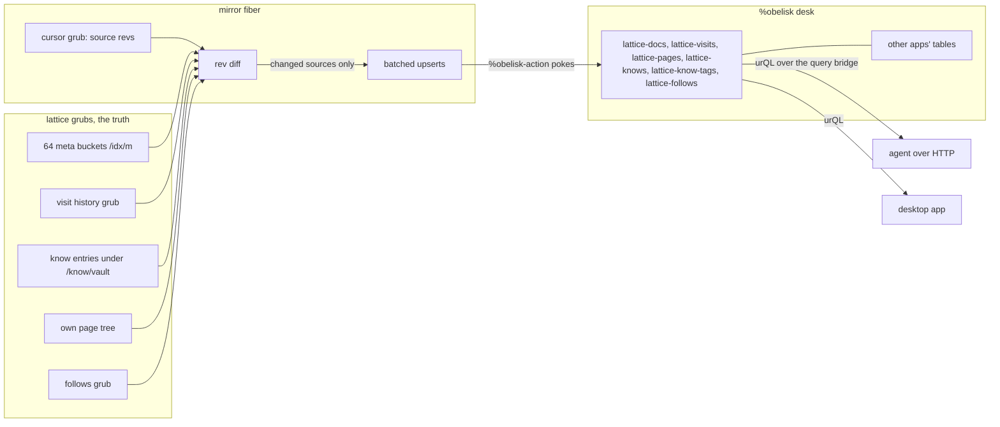
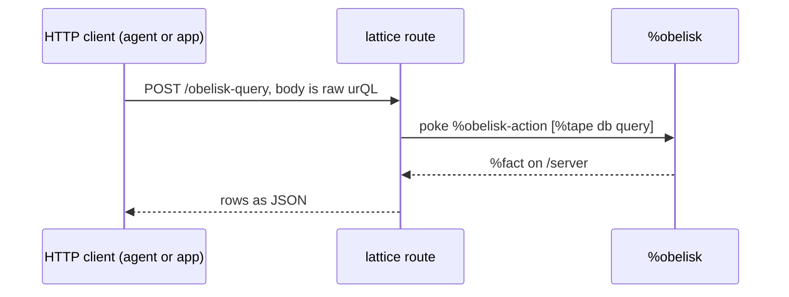

# The obelisk mirror: lattice data in the ship commons

Lattice keeps its truth in grubs. This document designs a second,
disposable copy of the record-shaped part of that truth in %obelisk, the
standalone relational store, so that queries can cross application
boundaries. The catalog specification (`docs/catalog-v2.md`, section 1)
explains why obelisk is not the catalog's storage engine. This document
is the other half of that decision. Obelisk returns in a role it is
actually good at. The storage and namespace costs that disqualified it
as a home do not apply to a disposable projection, and the one cost
that remains, single threaded query execution, is accepted for a
different traffic class (section 6, point 5).

## 1. Purpose and stance

The value of the mirror is not a lattice feature. It is the ability to
ask questions that no single application anticipated. A ship that holds
pages, visits, memories, follows, forum posts, and feed items in one
relational store can answer things like which authors appear across both
browsing history and forum activity, or what was seen about a topic in
any application during a given week. The first consumer already exists
today. An AI agent reaching the ship over MCP gets a structured query
surface instead of one bespoke route per question.

Five rules keep the mirror safe, and every design choice below follows
from them.

1. One-way flow. Rows move from grubs to obelisk, never back. No
   lattice feature reads the mirror to make a decision. The mirror
   machinery itself reads only its own probes and error results.
2. Meta, not bodies. The mirror carries titles, keys, ships, dates,
   kinds, and tags. Page bodies, snippets, and know bodies stay in
   grubs, where text search already lives.
3. Optional presence. No obelisk desk means no mirror and nothing else
   changes. This is the pandoc stance applied to a ship-side neighbor.
4. Disposable projection. The mirror can be dropped and rebuilt from
   grubs at any time by the same machinery that maintains it. It is
   never backed up and never migrated in place.
5. Paced writes. The mirror fiber trails the live state in bounded
   batches with an event boundary between batches. It never runs inline
   with a page view, a save, or a visit.

## 2. The store being written to

Everything below was verified live against the %obelisk distributed by
`~dister-nomryg-nilref` during the first catalog build in May 2026, and
it shapes the schema and the protocol more than any abstract design
preference does.

1. Obelisk has no scry interface and no eyre routes. Writes and queries
   are both pokes of `%obelisk-action` carrying urQL text, and query
   results arrive as a `%fact` on its `/server` path. Reads are
   therefore asynchronous and must be brokered (section 6).
2. Identifiers parse as `@tas`, so table and column names are
   kebab-case. An underscore is a parse error.
3. `JOIN ... ON` accepts a single equality only. A composite key cannot
   be a join key, which forces a synthetic single-column key for
   anything identified by a pair (section 3).
4. Queries are FROM-first. `WHERE` supports equality, comparison, and
   `AND`. `ORDER BY ... DESC` works. There is no `LIKE`, `LIMIT`,
   `COUNT`, `DISTINCT`, or `GROUP BY`, so aggregation and pagination
   belong to the caller, and free-text matching stays in the catalog
   buckets and the client where it already lives.
5. `INSERT` on an existing primary key is an error and never replaces.
   `UPDATE` on an absent row is a clean no-op. Together they form the
   two-poke upsert the first catalog shipped: an insert whose expected
   duplicate-key error is handled quietly, plus an update that no-ops
   on an absent row, correct in either order.
6. A parse or crud error aborts the whole multi-statement poke. Batch
   writes therefore need a per-row fallback (section 5).
7. `CREATE DATABASE` and `CREATE TABLE` both error on an existing
   target, so every create rides its OWN poke with the expected error
   swallowed. The first catalog learned this in production: a joined
   create script aborts at the first existing table and never creates
   the ones after it. A schema change never alters an existing table.
   The only migration is `DROP TABLE FORCE` plus recreate plus a
   cursor reset, which rule 4 above makes acceptable.
8. Value literals: ships are bare (`~zod`), text is single-quoted with
   `'` and `\` escaped and control bytes below 32 neutralized, dates are
   `@da` literals, and there are no `@uv` literals, so hashes are stored
   as `@ud` decimals via `(scot %ud (sham ...))`.

The urQL compilers and the two-poke upsert exist in tree history at the
parent of commit `3c65092` (the catalog removal) under
`lib/catalog.hoon`, with the escaper `+urq-esc` beside them in
`lib/catalog-analyzer.hoon`. Phase 1 salvages them rather than
rewriting them.

## 3. Document identity

The mirror forces a decision the catalog could defer. A catalog bucket
can key a document however it likes, but a relational row that other
tables join against needs one stable scalar key.

1. A document's permanent identity is the pair of its source ship and
   its path. Its canonical string form is `urb://~ship/path`. A revision
   qualifies a version of a document and is never part of its identity.
2. The join key is `doc-id`, computed as `(sham ship path)` and encoded
   as a `@ud` decimal. It is deterministic, so any writer that knows the
   pair can compute the key without a lookup, and it satisfies the
   single-equality join constraint.

`docs/catalog-v2.md` section 4 freezes the same identity for the meta
buckets, so catalog keys and mirror rows agree by construction.

## 4. The schema contract

The schema is a published contract, not an implementation detail. Once
an agent or another application queries these tables, their shapes are
an API. The conventions come first, then the tables.

1. Every lattice table is prefixed `lattice-`. Another application
   publishing into the commons prefixes its own name the same way.
2. Ships are `@p` columns, moments are `@da` columns, synthetic keys are
   sham hashes as `@ud` decimals.
3. Row deletion through urQL is unverified, so nothing depends on it.
   The curated tables (`lattice-pages`, `lattice-knows`,
   `lattice-know-tags`, `lattice-follows`) carry a `live` column
   (`@ud`, 1 or 0), dead rows are tombstoned by update, and consumers
   of those tables filter `WHERE live = 1`. The seen tables
   (`lattice-docs`, `lattice-visits`) carry no `live` column, because
   no writer can compute one (section 5, point 3).
4. The database is `%lattice`. One database per publishing app keeps
   the `CREATE DATABASE` bootstrap isolated per app, on top of what the
   table prefixes already prevent.

Phase 1 and 2 tables:

1. `lattice-docs`: `doc-id` (`@ud`, primary key), `ship` (`@p`), `pax`
   (`@t`), `kind` (`@t`), `title` (`@t`), `seen-at` (`@da`), `last-rev`
   (`@ud`, 0 when unknown). One row per seen document, mirrored off the
   catalog's meta buckets. Rows persist after the catalog's 20,000
   entry eviction window passes them by, so the mirror remembers longer
   than the catalog. That extra memory is best effort only. It is lost
   on any rebuild, because the eviction window is the only rebuild
   source, and no consumer may depend on it. Deletion of a document at
   its source is undetectable here, and its row simply stops changing.
2. `lattice-visits`: `doc-id` (`@ud`, primary key), `ship` (`@p`),
   `pax` (`@t`), `title` (`@t`), `last` (`@da`), `hits` (`@ud`). The
   history grub (`lib/lattice-history.hoon`) keeps ONE entry per url
   with its latest visit time and hit count, capped at 500 with a two
   week ttl, so a visit row is a per-document upsert rather than an
   event log. Rows whose source entry has expired out of the window
   persist under the same best-effort stance as `lattice-docs`.
3. `lattice-knows`: `know-key` (`@t`, primary key), `updated` (`@da`),
   `live` (`@ud`). Memory bodies never leave grubs.
4. `lattice-know-tags`: `tag-id` (`@ud`, primary key, sham of key and
   tag), `know-key` (`@t`), `tag` (`@t`), `live` (`@ud`). One row per
   tag application, which is how a many-to-many survives a store with
   single-equality joins.
5. `lattice-follows`: `follow-id` (`@ud`, primary key, sham of the
   ship), `ship` (`@p`), `live` (`@ud`). Follows are a bare set of
   ships in the source. Per-page subscriptions are a separate
   mechanism and a possible later table.
6. `lattice-pages`: `doc-id` (`@ud`, primary key, sham of our ship and
   the path), `pax` (`@t`), `kind` (`@t`), `title` (`@t`), `updated`
   (`@da`), `share` (`@t`), `live` (`@ud`). One row per own page,
   mirrored from the page tree. Own pages get real tombstones because
   their source is curated and enumerates in full.

Three tables are reserved for the structured intel layer, in its own
future document: `lattice-entities`, `lattice-mentions`,
`lattice-relations`. They join on `doc-id`, which is the reason
identity freezes now.

## 5. The mirror fiber

The mirror is a reconciler, not an event tail. It runs on a timer,
checks the change beacon each tick, and additionally diffs the history
grub locally, because visits deliberately never bump the content
beacon. An idle tick costs three local peeks and no obelisk traffic at
all. It subscribes to nothing and it cannot miss an update, because
its correctness comes from comparing state, not from observing every
change.

1. Change detection is content stamps, not storage revisions. Each
   pass reads the sources with the same peeks their list routes
   already perform (one deep page peek, the know map read, two small
   grub reads) and derives a stamp per row: a sham of body and share
   for a page, the updated time for a know, the set membership itself
   for tags and follows, a sham of title, last, and hits for a visit.
   The cursor stores one map of stamps per domain and diffs the sweep
   against it. Stamps were chosen over storage revisions because they
   need nothing from the storage layer's internals and a rerun after
   any crash re-derives exactly the same difference.
2. The cursor stays one grub, and every map in it is bounded: pages,
   knows, tags, and follows by curation (hundreds of entries in
   practice), visits by the history cap of 500. The curated maps
   double as the tombstone basis (point 3). A hard cap with a
   no-tombstone fallback is deliberately not implemented until a real
   vault approaches one.
3. A changed source is mirrored as one small `INSERT` poke per brand
   new row (expected duplicate-key errors swallowed, the shipped
   quiet-ensure pattern) followed by multi-statement `UPDATE` pokes in
   chunks of 32, safe as batches because an update on an absent row
   no-ops cleanly. New rows appear in the update set too, which is
   both the crash-safety net behind their inserts and what makes the
   update verdict alone authoritative for the cursor. Inserts are
   never batched, because one duplicate key would abort a batched poke
   whole (section 2, point 6). Event boundaries between chunks come
   from each round-trip's own waits (native-index.md fact 6). Tombstoning runs only for the curated
   domains, where the cursor's key map says exactly what was mirrored
   before: a pass diffs current keys against the map and tombstones
   the difference. The seen tables get no tombstones, as section 4
   states.
4. If a chunk's `UPDATE` poke fails, the fiber replays its updates one
   row at a time, so one poisoned row costs one row. This copies the
   drip's per-item fallback, and it is required by the all-or-nothing
   poke semantics (section 2, point 6).
5. The cursor advances only when a source's writes LANDED: every
   update batch's verdict (or its per-row replay's) gates the domain's
   cursor fold, so a failed write keeps the old stamps and the next
   pass retries it. A crash between a poke and the cursor write means
   the source reruns, and reruns are harmless because the upsert is
   idempotent.

Backfill is not a separate protocol. Cursor resets are per source, so
zeroing one source's revision or key map makes the next pass remirror
that source in full, and zeroing all of them is a full backfill. First
run, recovery after reinstall, and schema migration are the same code
path at different reset widths. A reset never touches another table's
key map, so tombstone state survives unrelated migrations.

## 6. The query bridge

Reads come back through lattice, because obelisk answers queries as
subscription facts rather than scry results.

1. `POST /obelisk-query` is owner-gated and passes the body through as
   urQL. The route holds the connection until the result lands or a 15
   second poll deadline passes.
2. Every caller runs its own round-trip. There is no owner fiber: the
   core's ack routing could not sustain one, so callers poke the desk
   directly and poll the shared `/server` materialization. The race
   that polling alone would allow is closed by a NONCE: every script
   carries a trailing `SELECT` of a fresh number, and a caller accepts
   only a result carrying its own number. A concurrent caller's answer
   fails the check and reads as not-yet-mine, so overlapping callers
   cost retries, never wrong verdicts. Error results pass the check
   unconditionally, which at worst misattributes one failure and a
   retry converges.
3. The same asynchrony means a synchronous MCP tool cannot serve reads.
   Agents query over authenticated HTTP. MCP writes remain possible but
   the mirror gives no reason for an external writer to exist.
4. Presence is read from the subscription's live grub when it exists,
   with a real `SELECT 1;` round-trip as the fallback verdict. The
   settings page shows the result, offers the install from the
   distributor when the desk is absent, and toggles the mirror's
   enabled flag, which the reconciler rechecks within five minutes in
   either state.
5. Commons queries run inside gall events on obelisk's side, the same
   single-threaded cost the catalog refuses for its serving path. The
   mirror accepts it for a different traffic class: occasional,
   user-initiated, analytical. urQL has no `LIMIT`, so callers keep
   result sets bounded with `WHERE` windows, comparison on `at` or
   `seen-at` being the intended pattern, and the bridge's poll
   deadline bounds the caller's wait, not obelisk's event.

## 7. Failure modes

1. Obelisk is not installed. The probe fails, the mirror sleeps, every
   lattice feature is unaffected. Install it from the settings page
   (or `|install ~dister-nomryg-nilref %obelisk`) and enable the
   mirror there; the next pass finds a zeroed cursor and backfills.
2. Obelisk is reinstalled empty. Each cycle starts with per-table
   probes, one `SELECT` of the primary key column per mirrored table,
   before any schema poke, so a wiped store still shows its missing
   tables. A table-missing error zeroes that table's cursor state.
   Then the bootstrap runs. The `CREATE DATABASE` poke rides alone and
   its expected already-exists error is swallowed, never read as a
   failure, and the `CREATE TABLE` poke is a no-op against live tables
   (section 2, point 7). The zeroed state backfills in the same pass.
3. The schema needs to change. Drop the changed table with
   `DROP TABLE FORCE`, recreate, and zero that table's cursor state
   only. The mirror rebuilds the one table while every other table's
   state, tombstone key maps included, stays untouched. Consumers see
   a gap, never wrong data.
4. A hostile or buggy value reaches the mirror. Text passes through
   `+urq-esc`, which neutralizes quote, backslash, and control bytes,
   the exact escaper the first catalog shipped and fuzzed.
5. Obelisk wedges mid-pass. Pokes nack or time out, the write
   verdicts come back false, the affected domains keep their old
   cursors, and the next pass retries them. The mirror lags and says
   nothing false.

## 8. Phases

1. Phase 1, built first because its sources all exist today, ships
   the bridge (`POST /obelisk-query` with nonce-verified round trips),
   the bootstrap and probes, the settings installer, and the mirrors
   for own pages, knows, know tags, follows, and visits. Cleaning a
   first-catalog database is a manual runbook step (the statements
   ship in the lib), removed from resident code after it destabilized
   the reconciler.
2. Phase 2 adds `lattice-docs` off the catalog's meta buckets, once
   catalog v2 phase 1 exists to feed it.
3. Phase 3 is the structured intel layer, specified separately, which
   adds entity tables that join against `doc-id`.

## 9. Testing

1. urQL is validated by a live obelisk, never by string-shape
   assertions. The constraints in section 2 all bite at obelisk's
   parser and crud layer, which no lattice-side unit test can see. The
   dev harness pokes real queries through the bridge on a fake ship
   pair, the same discipline the May catalog work established.
2. The mirror's invariant is convergence. After any interleaving of
   edits, crashes, and obelisk restarts, a quiesced mirror equals a
   fresh backfill. The test drives edits and kills between chunks, then
   compares a `SELECT` sweep against the meta buckets.
3. The per-row fallback is tested by planting one poisoned row in a
   chunk and asserting the other 31 land.
